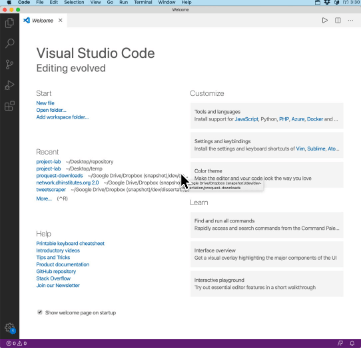
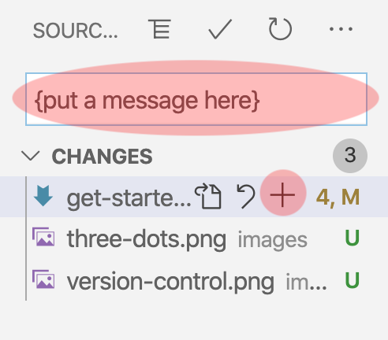
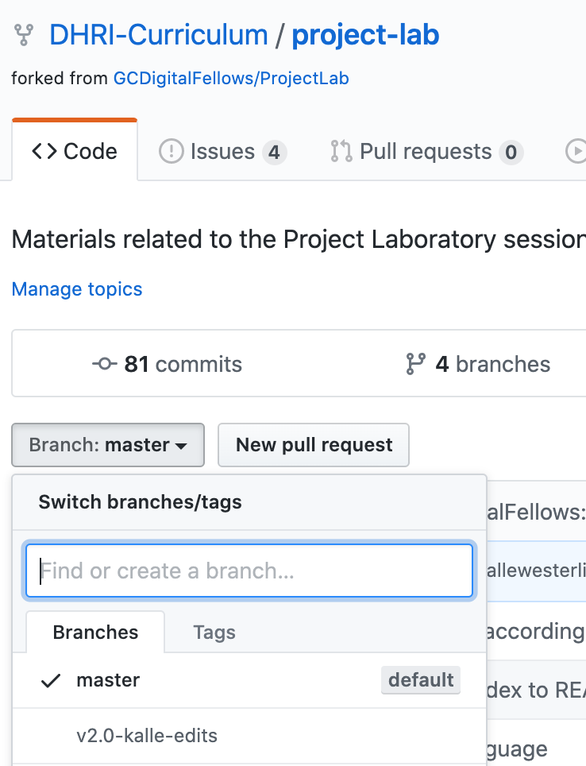

# How to contribute to/edit the DHRI curriculum

## Pre-requisite: Make sure software is up-to-date

The first thing you want to make sure is that your software is all up to date. We will work in VS Code, and using git, which means that you will want to make sure you have VS Code installed and all up to date.

You can download VS Code [here](https://code.visualstudio.com/download).

If you already have the program installed, make sure you go to the `Code` menu and select `Check for Updates...`

## Pre-requisite: Make sure git is enabled

Select `Code` > `Preferences` > `Settings` in the menu. In the window that shows up, make sure that the checkbox under "Git: Enabled" is selected.

(Optional:) If you run into trouble with anything in this manual, you might also want to make sure the checkbox next to "Git: Enable Commit Signing" is unchecked.

## A. Clone Repository

1. Navigate to the repository you want to edit.

2. Copy the link from the browser window.

3. In VS Code, press the Source Control image in the left-hand bar:

   

   _Alternatively: you can also find the navigation bar by selecting `View` > `SCM` from the menu._

4. Press the "Clone Repository" button.

   _Alternatively: you can also select `View` > `Command Palette...` and type in `git clone` in the field that appears. Then press enter._

5. In the field that appears, with the placeholder text "Provide repository URL," paste in the URL from Step 2 above. Then, press enter.

6. Select the folder where you want to save the repository locally.

7. In the dialog that appears, you can choose a new window for the repository files, by clicking "Open in New Window."

## B. Select Correct Branch

1. In VS Code, press the Source Control image in the left-hand bar:

   

   _Alternatively: you can also find the navigation bar by selecting `View` > `SCM` from the menu._

2. Press the three dots in the left-hand bar that appears:

   

3. From the menu that appears, choose "Checkout to..."

4. Start typing in the name for the branch that you will be working on (`v2.0-{your name}-edits`, for example)

5. Then press the "Create new branch from..." and then select "v2.0."

   _Why? This ensures that you start working from the most recent version that we have in the repository, and will also make it easier for us to synchronize your work when we move ahead to future steps in the editorial workflow.

## C. Synchronize Your Edits with GitHub

_Once you've made edits to your files, you will want to stage, commit, and synchronize all of your changes with git and GitHub._

1. In VS Code, press the Source Control image in the left-hand bar:

   

   _Alternatively: you can also find the navigation bar by selecting `View` > `SCM` from the menu._

2. Under the heading "Changes," you will now see a list of all the files, that have changes that are not yet "committed" to the repository (the next "saved stage" of the repository).

### "Stage" and "commit" the files

3. Press the `+` symbol next to each of the files that you want to stage.

4. Put a message in the box on the top of the list:

   

5. Press the commit button, which looks like a check mark:

   

   _Alternatively: Once you have finished your message press `⌘` and `Enter`._

If all goes well, you should receive no message at all, and the files should all disappear from your "Changes" list. That means that they have been "committed" to the saved stage that we are currently in.

Make as many of these edits, stages, and commits, throughout your day as you want. Then move on to the next step:

### Synchronize with GitHub

_Once you are done making edits to your files for the day (or at any point that you want to make sure everything is saved in the cloud), you will want to synchronize all of your changes with GitHub._

6. Press the icon on the bottom bar that looks like either a little cloud with an arrow going into it, or a "recycling" symbol:

   

   

   _Why are there different symbols? The look of them depend on how you may have worked previously with GitHub in VS Code._

7. (_Optional._) VS Code might ask you if you want to periodically run `git fetch` automatically. Select "Yes."

   _Why? VS Code offers here to help make sure that your local copy of the repository is always in sync with the one in the cloud, GitHub._

8. (_Optional._) If you want to make sure that your edits have been correctly uploaded, you can navigate to the repository on GitHub, and make sure you select the correct branch under the dropdown menu. You should see your latest version there.

   
