# The Review Process explained

## How to start the review process

1. **Navigate to the workshop you have edited.**

2. **Press "New Pull Request."**

   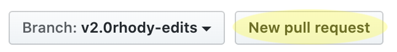

3. **Make sure to select the base repository as the one that belongs to DHRI-Curriculum.**

   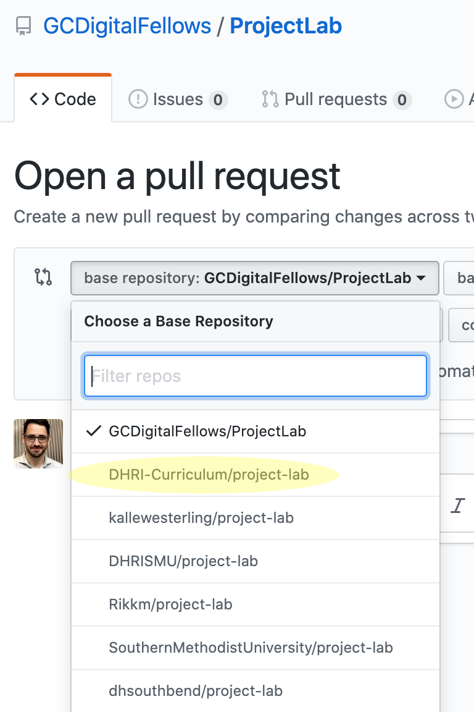

4. **Ensure that `v2.0` is selected as the upstream (base reference) and that your work is selected as comparison (head reference)**

   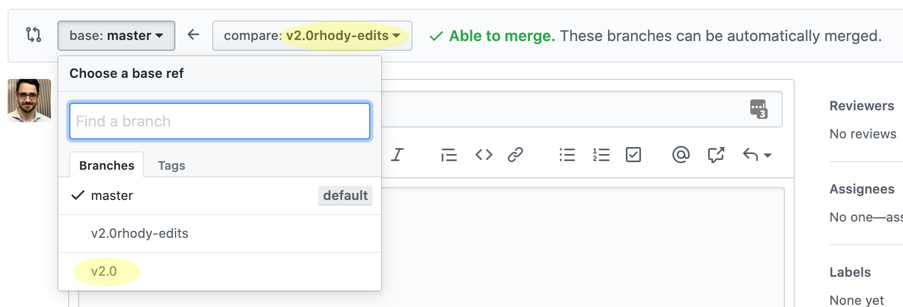

5. **Press the large green button with the label "Create pull request."**

   

_In the dialog that appears next, you don't necessarily need to write anything, but **it's a nice gesture**._

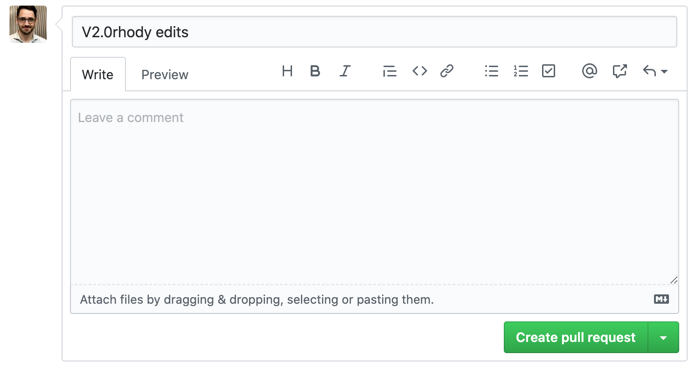

6. **Press "Create pull request."**

7. **Press the cogwheel next to the "Reviewers" heading:**

   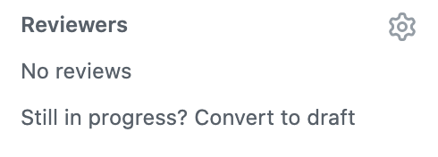

8. **Select the person who will be reviewing your work:**

   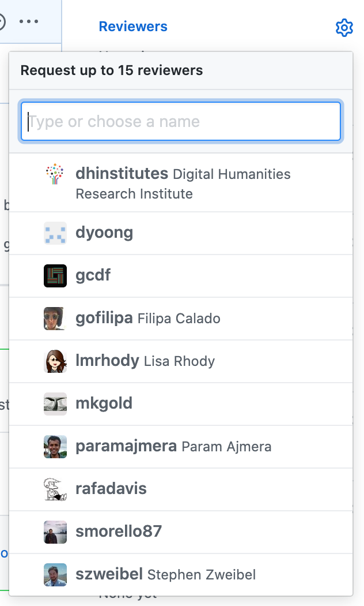

9. **Press the cogwheel next to the "Projects" heading:**

   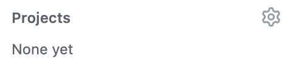

10. **Select the project that you are working on:**

   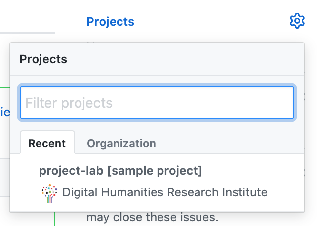

11. **Press the cogwheel next to the "Milestones" heading:**

   

12. **Select the milestone that you are working on:**

   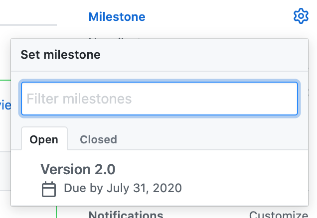

You're done! Your reviewer will receive an email:

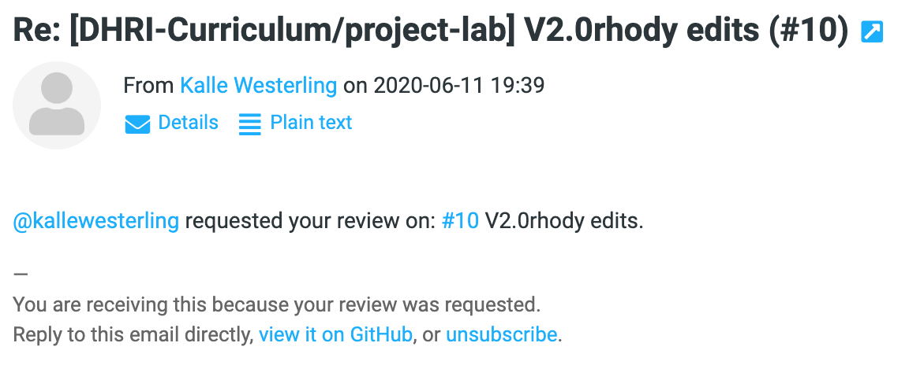

## How to fix things

You've received a request to fix something? What to do next?

### I can fix it!

Just push more commits to the same branch that you've been working on all along. They will automatically belong to the same pull request.

### It seems like an issue for a later sprint!

Next to the issue that you can't resolve—or think rather belong in a later sprint—open a new issue.

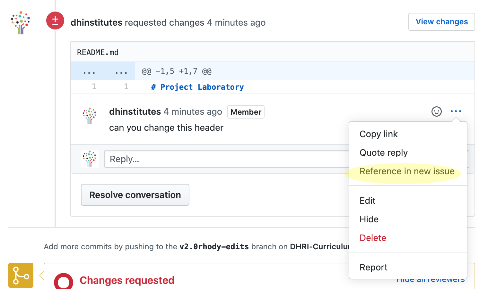

### I am done making revisions

When you're done making revisions to the repository, you can request a new review by pressing the "Re-request review" button next to your reviewers name:

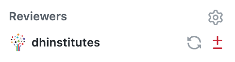
