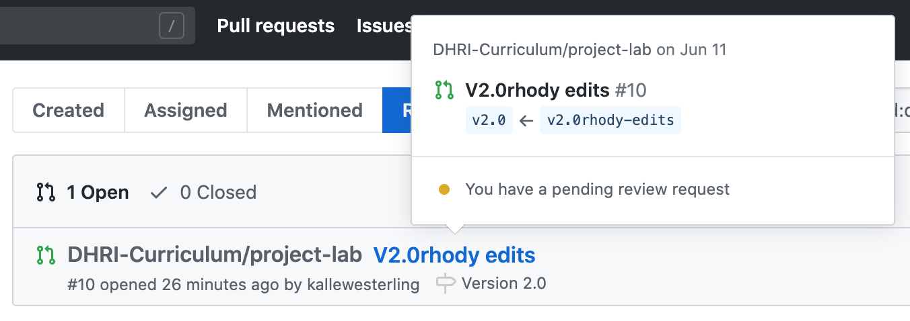
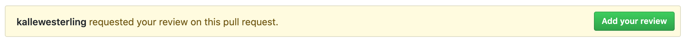
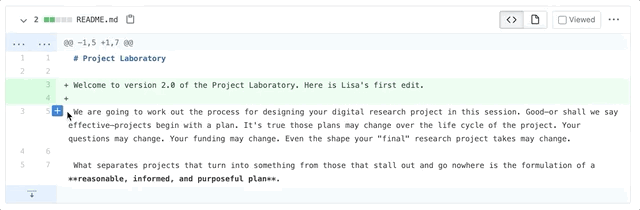
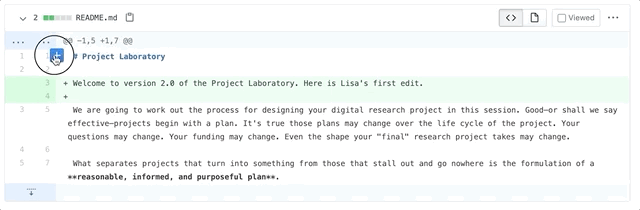

# Reviewing workshops

So you have received a review request? What to do next?

## A. Starting a review

1. Login to GitHub, and go to [this page](https://github.com/pulls/review-requested).

2. Make sure you click on the correct item: the name of the review request.

   

3. Press the green "Add your review" button.

   

## B. Adding comments

### Single line comment

Add a single line comment by hovering over the line where you want to leave a comment, and press the blue cross that appears.

### Multi-line comment

Add a multi-line comment by hovering over the first line where you want to leave a comment, and then dragging along the left side of the lines where the blue cross appears.

## Requesting follow-up or approving

Once you are done, find the green "Finish your review" button, and type up a comment.

Make sure that you select "Approve" or "Request changes" from the options below the comment.

Finally, press "Submit review."

